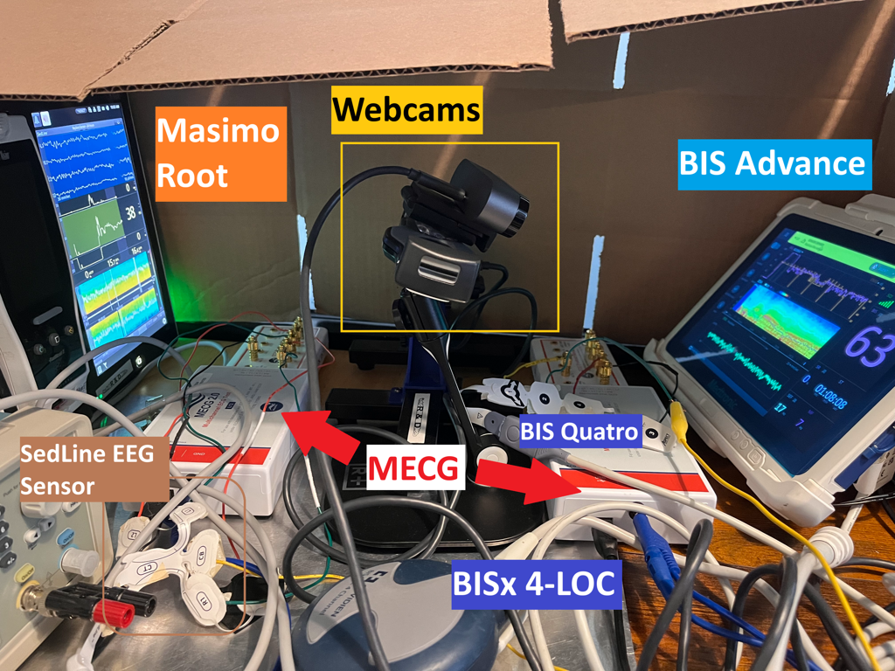

# ControlMultipleMECG

Control_Both_MECG_Jason_v1_7.py
Script used to select the case-specific WhaleTeq replay file, connect to the designated MECG device, start playback, stop playback, and write run logs. Whaleteq SDK can be downloaded from: https://pascallqms.atlassian.net/browse/IEE-352 

The script performs the following for each selected M0 case:

Start capture
    Start BIS Advance display capture (video or images taken at multiple second intervals).
    Start SedLine display capture (video or images taken at multiple second intervals).

Run case
    Replay the M0 EEG for full case duration on the chosen EEG system
    Stop recordings.

Data logging
    Upload raw media to controlled storage with correct naming convention.

Before each recording session:
    Run the MECG control script (Control_Both_MECG_Jason_v1_7.py)

    Verify that the MECG control script can detect the intended MECG device IDs.
        “device is connected (WME2101-240xxx)” will be printed for each connected MECG.

    Verify that the camera capture script can detect the correct BIS and SedLine webcams.
        “[device_cam] started (x) is_open=True” will be printed for each cam successfully started.

    Confirm that the output directory for the session is writable.
        Set zipResults to True to save a .zip folder in the OUTPUT_ROOT. This will require storage on the laptop disc.

    Confirm that the selected case replay file exists and matches the intended case ID.
        “[timestamp], [device] started case x - saving images to your/path” will be printed for each output directory.

    In the event that any issues arise, double-check the folder, cam_path, path to MECG20x64.dll, and device name.
        folder variable should be changed to the path that input files are stored.
        cam1_path and cam2_path should be changed to the index of the webcams used.

    Press Windows key + X and select Device Manager to check if webcams are connected.
        Device class should be instantiated with a string device name and a path to the MECG20x64.dll and MECG20x64.2.dll files on your computer. To connect more MECGs, simply duplicate this file, rename it to MECG20x64.n.dll, and pass it to a Device class.
Channel Mapping and Scaling
When using MECG, if Lead I or Lead II are being used, apply the Wilson Terminal lead-cancellation (e.g., scaling V1-6 as appropriate) so that the intended differential signals appear at the monitor input. If using convert_to_whaleteq_format_v2_v0.py, this is done automatically.